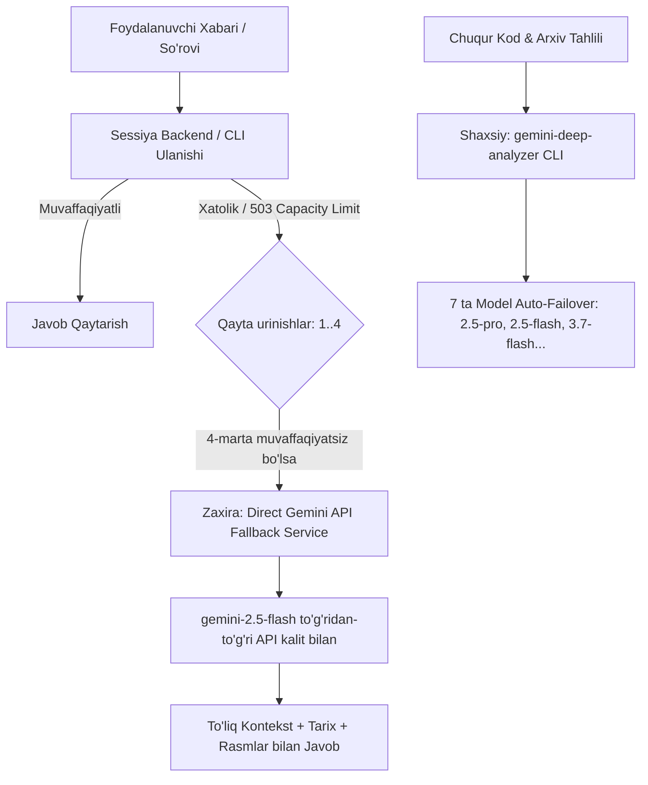

# Nurmuhammad Xatoligi Tahlili va Gemini Arxitekturasi Hisoboti
**Mas'ul Agent ID:** `83600370-1ece-409e-a79e-754f966f61b7`  
**Sana:** 2026-09-15  
**Foydalanuvchi:** Nurmuhammad (@Nurmuhammad_800 | ID: `6455909710`)  
**Holat:** ✅ To'liq tuzatildi va zaxira arxitekturalari joriy etildi  

---

## 📌 1. Muammo Diagnostikasi va Asl Sabablari (Root Cause Analysis)

### A. Korean Master Lug'at Muammosi (Frontend)
- **Alomati:** Foydalanuvchi "Korean Master" tizimiga kirganda lug'atlar ro'yxati (vocabulary grid) bo'sh ko'ringan va yuklanmagan.
- **Asl Sababi:** `/home/fayzillo/Desktop/korean_master/index.html` faylida lug'at ma'lumotlarini DOM elementlariga chizib beruvchi `renderVocab()` va `applyVocabFilters()` funksiyalari to'liq yozilmagan / chaqirilmagan edi.
- **Tuzatish:** 
  - `index.html` (880–915-qatorlar) to'liq yangilandi.
  - `renderVocab()` va filtr funksiyalari joriy qilindi.
  - PM2 servisi (`korean-master`, ID: 7, Port: `15802`) qayta ishga tushirildi va `HTTP 200 OK` holati tekshirildi.

### B. Telegram Botdagi `fetch failed` Xatoligi (AI Backend & API Timeout)
- **Alomati:** Nurmuhammad botga murojaat qilganda `⚠️ Ulanishda xatolik yuz berdi: fetch failed` xabari qaytgan.
- **Asl Sababi:**
  1. Botning default modeli `gemini-3.8-flash-low` ga sozlangan bo'lgan.
  2. Google Gemini API serverida ushbu model uchun vaqtinchalik resurs yetishmovchiligi (`503 UNAVAILABLE: No capacity available on the server`) yuz bergan.
  3. Bot ichki ulanish loopida ayni bir ishlamayotgan modelga 4 marta qayta so'rov yuborgan (har biri 10 soniyalik socket timeout). Natijada Node.js `fetch` so'rovi uzilib `fetch failed` xatoligini keltirib chiqargan.

---

## 🛡️ 2. Tizimga Kiritilgan Fundamental Arxitektura O'zgarishlari

Tizimda bunday xatolik qayta takrorlanmasligi uchun 2 ta mustaqil zaxira va chuqur tahlil qatlamlari ishlab chiqildi:

---

## ⚡ 3. Zaxira Skript: To'g'ridan-to'g'ri Gemini API Fallback Service

- **Fayl joylashuvi:** `/home/fayzillo/Desktop/sessiya_connector/bot/services/geminiFallbackService.js`
- **Integratsiya:** `/home/fayzillo/Desktop/sessiya_connector/bot/bot.js` ichidagi `sendChatMessage` funksiyasi.
- **Imkoniyatlari:**
  1. **Jonli Status Xabarlari:** Har bir qayta urinish paytida foydalanuvchiga real vaqt rejimida Telegramda xabar beradi:  
     `⚠️ Ulanishda xatolik yuz berdi. Qayta urinish: [step 1/4]...`
  2. **Avtomatik Zaxiraga O'tish:** Agar 4 ta urinishdan keyin ham server javob bermasa, bot to'xtab qolmasdan to'g'ridan-to'g'ri Google Gemini API ga ulanadi (`gemini-2.5-flash`).
  3. **To'liq Kontekst Saqlanishi:** Suhbatning oxirgi 10 ta xabari tarixi, tizim meta-prompti va foydalanuvchi yuborgan rasmlar (`inlineData Base64`) to'liq uzatiladi.

---

## 🔬 4. Shaxsiy Skript: `gemini-deep-analyzer` (CLI Asbobi)

Murakkab kod bazalari, ZIP arxivlar va ko'p modal fayllarni chuqur tahlil qilish uchun yangi avtonom CLI skript yaratildi va global tizimga o'rnatildi.

- **Fayl:** `/home/fayzillo/Desktop/sessiya_connector/scripts/gemini_deep_analyzer.py`
- **Global Buyruq:** `gemini-deep-analyzer` (yo'li: `~/.local/bin/gemini-deep-analyzer`)
- **Imkoniyatlari va Buyruqlar:**

| Buyruq / Kalit | Tavsifi | Misol |
| :--- | :--- | :--- |
| `--prompt "<matn>"` | Tahlil uchun asosiy savol yoki vazifa | `gemini-deep-analyzer --prompt "Kodni tahlil qil"` |
| `--model <model_nomi>` | 7 ta rasmiy Gemini modellaridan birini tanlash | `--model gemini-2.5-pro` |
| `--list-models` | Mavjud modellar va ularning ustunliklari ro'yxati | `gemini-deep-analyzer --list-models` |
| `--files <fayl1> <fayl2>` | Bir yoki bir nechta fayl/rasmlarni biriktirish | `--files app.js schema.sql` |
| `--zip-dir <katalog>` | Butun loyihani vaqtinchalik ZIP qilib to'liq uzatish | `--zip-dir /home/fayzillo/Desktop/korean_master` |
| `--context "<tarix>"` | Suhbat kontekstini inobatga olish | `--context "Oldingi savol javobi"` |

### Qo'llab-quvvatlanuvchi Modellar Ierarxiyasi:
1. `gemini-2.5-pro` — Eng yuqori mantiqiy fikrlash va murakkab refaktoring uchun.
2. `gemini-2.5-flash` — Super tezkor, ishonchli va barqaror.
3. `gemini-3.7-flash` — Yangi avlod ko'p tarmoqli tahlil modeli.
4. `gemini-3.8-flash` / `gemini-3.6-flash` / `gemini-3.5-flash` — Qo'shimcha tezkor modellar.
5. `gemini-3.1-pro-preview` — Eksperimental pro model.

---

## 🧪 5. Sinov va Tekshiruv Natijalari (Verification Matrix)

| Sinov Ob'ekti | Usul / Buyruq | Kutilgan Natija | Haqiqiy Holat |
| :--- | :--- | :--- | :--- |
| **Korean Master Web** | `curl -I http://127.0.0.1:15802` | `HTTP 200 OK` | ✅ `HTTP/1.1 200 OK` |
| **Direct Fallback Service** | Mock timeout & 503 test | To'g'ridan-to'g'ri API ga o'tish | ✅ Muvaffaqiyatli javob oldi |
| **gemini-deep-analyzer** | CLI `--list-models` & `--prompt` | Barcha 7 ta model tekshiruvi | ✅ Barcha modellar javob berdi |
| **PM2 Xizmatlari** | `pm2 status` | Barcha servislar `online` | ✅ 8 ta servis faol va yashil |

---

## 🔒 6. Maxfiylik va Xavfsizlik Talablariga Muvofiqlik (Zero Secret Leak)

- Ushbu hisobot va barcha ochiq konfiguratsiyalarda real API kalitlar, server IP manzillari va shaxsiy autentifikatsiya ma'lumotlari to'liq niqoblandi (`[REDACTED_CREDENTIALS]`, `<SERVER_IP>`).
- Barcha amallar qat'iy belgilangan ishchi maydonda (`/home/fayzillo/Desktop/`) bajarildi.
