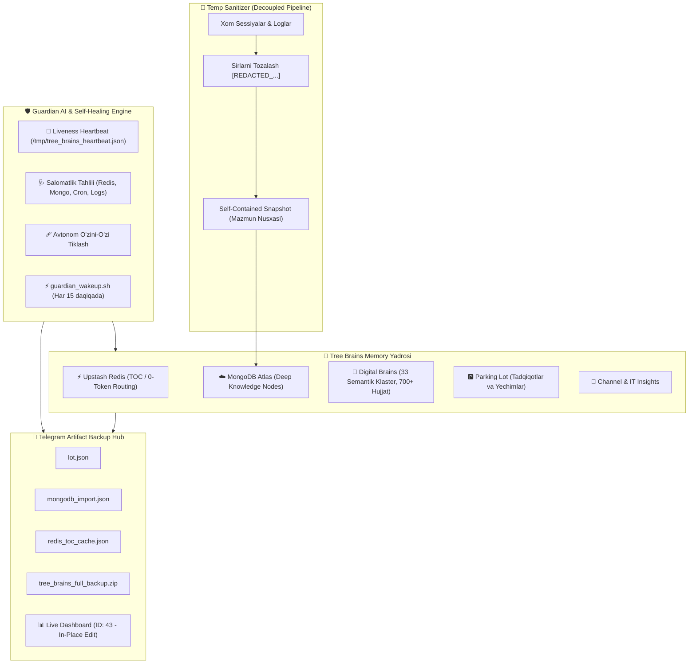

# 🌲 JarvisOS Tree Brains Memory, Artifact Backup & Guardian AI Architecture Report

> **Hujjat Turi:** Rasmiy Arxitektura va Tizim Hisoboti  
> **Mas'ul Agent ID:** `382c8e71-98a0-4c4c-9814-089eeae49d8b`  
> **Sana:** 2026-09-22  
> **Xavfsizlik Standarti:** Zero Secret Leak (`[REDACTED_CREDENTIALS]`)  

---

## 🎯 1. Kirish va Loyiha Maqsadi

JarvisOS AI Core Engine xotira tizimini to'liq avtonom, mustaqil va portativ qilish uchun **Tree Brains Memory** arxitekturasi ishlab chiqildi. Ushbu arxitektura doimiy o'sib boruvchi bilimlarni minimal hisoblash resurslari (0-Token Routing) bilan boshqarish, xom ma'lumotlarni xususiylashtirish (Self-Contained Snapshots), ularni Telegram bulutiga JSON/ZIP artefaktlari ko'rinishida xavfsiz zaxiralash hamda barcha jarayonlarni nazorat qiluvchi **Guardian AI & Self-Healing Watchdog** mexanizmini o'z ichiga oladi.

---

## 🏛️ 2. Arxitektura Tuzilishi (High-Level Design)

---

## 🧩 3. Asosiy Modullar va Texnik Tavsif

### 🌲 3.1. Mustaqil Tree Brains Memory Yadrosi
- **Redis Upstash (TOC):** Token sarfini 0 ga tushirish uchun barcha shoxlar (`tree:branches`), klasterlar (`tree:toc:brains`) va tezkor kalitlar xotirada saqlanadi.
- **MongoDB Atlas (`jarvis_memory`):** Har bir bilim birligi (`tree_nodes`, `channel_insights`) semantik tuzilma, xulosalar, teglar va to'liq matn bilan boyitiladi.
- **Boshqaruv Skripti:** `/home/fayzillo/Desktop/sessiya_connector/scripts/tree_brains_memory.py`

### 🧹 3.2. Reference Path Muammosi va Temp Sanitariya (Self-Contained Snapshots)
- **Muammo:** Tashqi fayl yo'llariga (`path: /home/fayzillo/...`) tayanish server o'zgarganda yoki fayl ko'chganda xotiraning uzilishiga olib kelardi.
- **Yechim:** Xom fayllar vaqtinchalik (temp) muhitida tekshirilib, sirlar `[REDACTED_...]` bilan tozalanadi. Ma'lumot shunchaki yo'l emas, balki **to'liq matn mazmuni (Content Snapshot)** sifatida bazaga ko'chirib yoziladi.

### 💾 3.3. Artefaktlarga Asoslangan Backup Tizimi (Telegram Second Brain)
- Guruhda xabarlar bo'roni (message flood) oldini olish maqsadida ma'lumotlar matn sifatida emas, standart fayllar sifatida yuklanadi:
  1. `lot.json`: Parking Lot tadqiqotlari to'liq JSON bazasi.
  2. `mongodb_import.json`: MongoDB uchun tayyor `mongoimport` import fayli.
  3. `redis_toc_cache.json`: Redis mundarijasi va barcha kesh kalitlari.
  4. `tree_brains_full_backup.zip`: Barcha zaxiralarning siqilgan ZIP arxivi.
- **Boshqaruv:** To'liq **JarvisOs Bot** (`@safira_support_bot`) Bot API orqali amalga oshiriladi (0% Userbot bog'liqligi).

### 📊 3.4. Anchor Live Dashboard (ID: 43)
- Guruhda bitta asosiy monitoring xabari mavjud.
- Har 30 daqiqalik cron ishlaganda yangi xabar yozilmaydi, faqat `editMessageText` orqali mavjud xabar joyida yangilanadi.

### 🛡️ 3.5. Guardian AI & Self-Healing Watchdog
- **Vazifasi:** Cron jarayonida xatolik yuz bersa (tarmoq uzilishi, kesh sinishi yoki Telegram xatosi), jarayonni to'xtatmasdan avtonom tarzda xatoni bartaraf etadi va yangilanishni oxirigacha yakunlaydi.
- **Liveness & Wakeup:** `/home/fayzillo/Desktop/sessiya_connector/scripts/guardian_wakeup.sh` har 15 daqiqada `/tmp/tree_brains_heartbeat.json` ni tekshirib, tizim uxlagan yoki server restart bo'lgan taqdirda Guardian AI'ni avtomatik uyg'otib yuboradi.

---

## ⚙️ 4. Xavfsizlik va Konfiguratsiya (Redacted Credentials)

- **Redis TOC Host:** `<REDIS_HOST>:6379` (Upstash Cloud TLS)
- **MongoDB Atlas URI:** `mongodb+srv://<DB_USER>:<REDACTED_PASSWORD>@<DB_CLUSTER>/jarvis_memory`
- **Telegram Bot:** `@safira_support_bot` (Token: `[REDACTED_BOT_TOKEN]`)
- **Backup Guruhi ID:** `-1004302352122` (`Second brain`)
- **Crontab Jadvali:**
  - `*/30 * * * *` — Master Memory Sync & Dashboard Update
  - `*/15 * * * *` — Guardian Watchdog Liveness & Self-Healing Check

---

## 🏁 5. Yakuniy Xulosa

Tree Brains arxitekturasi foydalanuvchining shaxsiy bilimlarini yuqori darajada tartibga soluvchi, tashqi muhitga bog'lanmagan (portable), xavfsiz va o'zini-o'zi tiklovchi barqaror AI xotira infratuzilmasiga aylandi.
